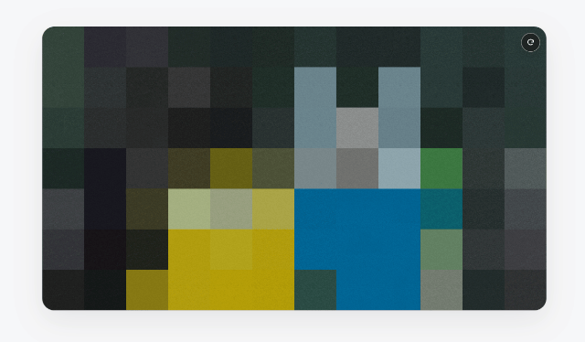

# Pixel Mosaic Lazy Loader

[](https://www.npmjs.com/package/@dong-gri/pixel-mosaic-lazy-loader)
[](https://www.npmjs.com/package/@dong-gri/pixel-mosaic-lazy-loader)
[](../../LICENSE)


[English (default)](../../README.md) · [한국어](./README.ko.md) · [日本語](./README.ja.md) · [繁體中文（台灣）](./README.zh-TW.md) · [ไทย](./README.th.md) · [简体中文](./README.zh-CN.md) · [繁體中文](./README.zh-Hant.md) · **Русский** · [Italiano](./README.it.md)

Показывает изображение как **крупные пиксели → мелкие пиксели → оригинал** без отдельного низкокачественного placeholder-файла и без остановки GIF, Animated WebP и APNG.



[**Live Demo**](https://git.dongri.me/example/pixel-mosaic-live/) · [**npm**](https://www.npmjs.com/package/@dong-gri/pixel-mosaic-lazy-loader) · [**Blog Post**](https://lab.dongri.me/p/pixel-mosaic-lazy-loader)

Текущий релиз: **v1.3.4**

## Зачем использовать Pixel Mosaic Lazy Loader?

- Ноль зависимостей и никаких отдельных низкокачественных изображений
- Поддержка статических изображений, GIF, Animated WebP и APNG
- Автоматическое обнаружение динамически добавленных изображений
- Пошаговый fallback для доступности и слабых устройств

## Быстрый старт

### npm

Используйте с Vite, webpack, Parcel или другой ESM-совместимой системой сборки.

```bash
npm install @dong-gri/pixel-mosaic-lazy-loader
```

```js
import PixelMosaic from '@dong-gri/pixel-mosaic-lazy-loader';
import '@dong-gri/pixel-mosaic-lazy-loader/style.css';

const mosaic = PixelMosaic.init({
  duration: 1600,
  startDelay: 100,
  steps: 'auto',
  stepCount: 8
});
```

### jsDelivr CDN

После публичной публикации в npm те же файлы автоматически становятся доступны через jsDelivr.

В URL CDN ниже версия не указана, поэтому автоматически используется текущий релиз npm с тегом `latest`.

> [!WARNING]
> После публикации новой версии npm CDN-адреса без версии также обновятся автоматически.

```html
<link rel="stylesheet" href="https://cdn.jsdelivr.net/npm/@dong-gri/pixel-mosaic-lazy-loader/dist/pixel-mosaic.css">
<script src="https://cdn.jsdelivr.net/npm/@dong-gri/pixel-mosaic-lazy-loader/dist/pixel-mosaic.js"></script>
<script>
  PixelMosaic.init({
    duration: 1600,
    startDelay: 100,
    steps: 'auto',
    stepCount: 8
  });
</script>
```

#### Minified-файлы CDN

Для продакшена можно использовать уменьшенные файлы ниже, если читаемый исходный код не нужен.

**jsDelivr**

- JavaScript: `https://cdn.jsdelivr.net/npm/@dong-gri/pixel-mosaic-lazy-loader/dist/pixel-mosaic.min.js`
- ES Module: `https://cdn.jsdelivr.net/npm/@dong-gri/pixel-mosaic-lazy-loader/dist/pixel-mosaic.min.mjs`
- CSS: `https://cdn.jsdelivr.net/npm/@dong-gri/pixel-mosaic-lazy-loader/dist/pixel-mosaic.min.css`

**unpkg**

- JavaScript: `https://unpkg.com/@dong-gri/pixel-mosaic-lazy-loader/dist/pixel-mosaic.min.js`
- ES Module: `https://unpkg.com/@dong-gri/pixel-mosaic-lazy-loader/dist/pixel-mosaic.min.mjs`
- CSS: `https://unpkg.com/@dong-gri/pixel-mosaic-lazy-loader/dist/pixel-mosaic.min.css`

### ES Module через CDN

```html
<script type="module">
  import PixelMosaic from 'https://cdn.jsdelivr.net/npm/@dong-gri/pixel-mosaic-lazy-loader/dist/pixel-mosaic.mjs';

  PixelMosaic.init({
    duration: 1600,
    startDelay: 100,
    steps: 'auto',
    stepCount: 8
  });
</script>
```

### unpkg CDN

unpkg автоматически зеркалирует публичные npm-пакеты. Новая версия может появиться через несколько минут.

```html
<link rel="stylesheet" href="https://unpkg.com/@dong-gri/pixel-mosaic-lazy-loader/dist/pixel-mosaic.css">
<script src="https://unpkg.com/@dong-gri/pixel-mosaic-lazy-loader/dist/pixel-mosaic.js"></script>
```

## Возможности

- Автоматическое обнаружение изображений, включая добавленные после загрузки страницы
- Простое число этапов или собственный массив размеров пикселя
- Настраиваемая длительность и задержка старта
- Живой шум, похожий на Photoshop Noise
- Сохранение воспроизведения GIF, Animated WebP и APNG
- Прогрессивное улучшение и поэтапный fallback
- Настройки производительности для мобильных и слабых устройств
- Доступность, включая `prefers-reduced-motion`
- Поддержка `border-radius`, прозрачности, `object-fit` и `object-position`

## Базовое использование

Добавьте `data-pixel-mosaic` к изображению и инициализируйте библиотеку.

```html

```

```js
const mosaic = PixelMosaic.init({
  autoDetect: true,
  autoSelector: 'main img:not([data-no-pixel-mosaic])',
  duration: 1400,
  startDelay: 100,
  steps: 'auto',
  stepCount: 8,
  fadePortion: 0,
  maxConcurrent: 2,
  quality: 'auto',
  noise: {
    enabled: true,
    opacity: 0.14,
    fps: 20,
    monochrome: true,
    blendMode: 'soft-light'
  }
});
```

## Этапы пикселизации

Для простой настройки используйте `steps: 'auto'` и `stepCount`; для точного контроля передайте массив размеров пикселя.

```js
PixelMosaic.init({
  duration: 1600,
  steps: [64, 40, 24, 14, 8, 4, 2]
});
```

## Настройки отдельного изображения

HTML data-атрибуты переопределяют глобальные параметры для конкретного изображения.

```html

```

## Анимированные изображения

Если доступны `ImageDecoder` и нужный кодек, кадры декодируются и пикселизуются напрямую. Иначе исходная анимация продолжает воспроизводиться, а Canvas-мозаика накладывается поверх. При отсутствии Canvas остаётся CSS-fallback с исходным изображением.

## Браузеры и устройства

### Минимальная поддержка браузеров

Chrome/Edge 80+, Firefox 74+, Safari 13.1+, iOS Safari 13.4+, Samsung Internet 13+, Android WebView 80+. Internet Explorer не поддерживается.

### Рекомендуемая среда

Используйте две последние основные версии Chrome, Edge, Firefox или Safari по HTTPS. Покадровая анимированная мозаика зависит от `ImageDecoder`, кодека, CORS и реализации браузера.

### Рекомендации по производительности

Консервативный минимум: 2 ядра CPU, 2 ГБ RAM, изображения до 1280×720, `maxConcurrent: 1`, шум до 12fps. Для более плавной работы: 4 ядра CPU, 4 ГБ RAM, изображения до 1920×1080, `maxConcurrent: 2`, шум 20–24fps. Реальная нагрузка зависит от числа пикселей, DPR, количества одновременных изображений и FPS шума.

### Поэтапный fallback

- Доступен `ImageDecoder`: прямое декодирование кадров
- Доступен Canvas: статическая мозаика и композиция с сохранением анимации
- Нет Canvas: CSS-переход
- `prefers-reduced-motion: reduce`: эффект пропускается, оригинал показывается сразу

## Доступность и производительность

- Исходный `` и текст `alt` остаются в документе
- Canvas-слои скрыты от вспомогательных технологий и не перехватывают события указателя
- Указывайте `width` и `height`, чтобы уменьшить сдвиги макета
- `quality: 'auto'` учитывает Save-Data, память устройства, потоки CPU и тип указателя
- Прямое декодирование кросс-доменных анимаций требует CORS, но fallback с сохранением воспроизведения работает без CORS

## API

```js
const mosaic = PixelMosaic.init(options);

mosaic.scan(document.querySelector('.new-content'));
mosaic.play(document.querySelector('#hero-image'));
mosaic.replay(document.querySelector('.gallery'));
mosaic.destroy();
```

## Основные параметры

| Параметр | По умолчанию | Описание |
|---|---:|---|
| `duration` | `1250` | Длительность перехода в мс |
| `startDelay` | `100` | Время удержания первого состояния мозаики |
| `steps` | `'auto'` | Автоматические этапы или массив размеров пикселя |
| `stepCount` | `8` | Число автоматически создаваемых этапов |
| `fadePortion` | `0` | Доля crossfade Canvas; 0 сразу показывает оригинал |
| `maxConcurrent` | `3` | Максимум одновременно обрабатываемых изображений |
| `quality` | `'auto'` | `auto`, `low`, `balanced`, `high` |
| `animatedMode` | `'auto'` | `auto`, `decode`, `preserve` |
| `respectReducedMotion` | `true` | Учитывать уменьшение движения |

## Языки демо

Публичное демо поддерживает корейский, английский, японский, традиционный китайский для Тайваня, тайский, упрощённый китайский, традиционный китайский, русский и итальянский. Оно определяет язык браузера, запоминает выбор и принимает параметры URL вроде `?lang=en`.

## Ограничения

- Сложные transform, маски и комбинации `clip-path` могут не идеально совпасть с Canvas
- Определение и прямое декодирование кросс-доменных Animated WebP/APNG требует CORS
- Возможности анимации различаются между браузерами, поэтому всегда есть fallback с сохранением воспроизведения

## Лицензия

MIT © [dongri.me](https://dongri.me) · Создано с помощью AI vibe-coding.
